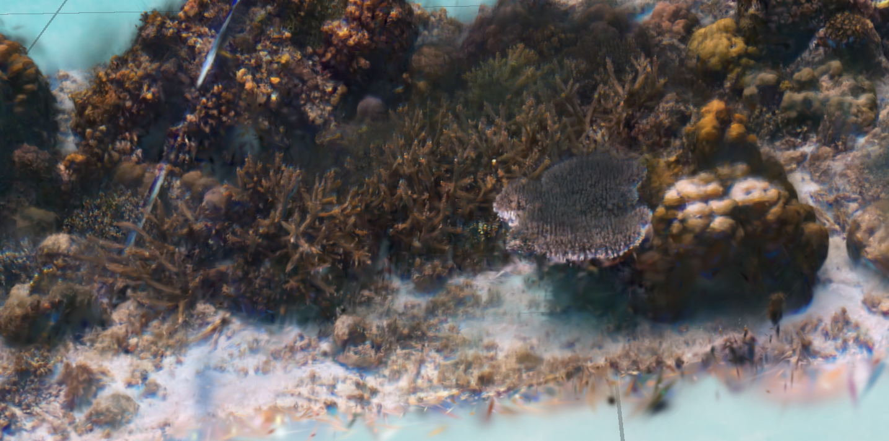

# `"hello world!" (updated January 2026)`

🪸 I'm a VR researcher focused on the human computer interaction of multi-user scientific and engineering interfaces. The coral image above is a cross-platform accessible gaussian splat render of a coral reef from Indonesia, using data from [wildflow.ai](https://wildflow.ai).

🧑‍🔬 I work out of the [SET Lab](https://setlab.soe.ucsc.edu/) as PhD student where I practice design research.  

🧠 I specialize in WebXR development and [three.js](https://threejs.org/) applications, especially those that involve 3D interfaces, networking code, and scalability.

✨ I owe a lot to creative code communities, such as the [p5.js](https://p5js.org/) community for mentorship and profound creative inspiration, the Google Summer of Code program for teaching me how to contribute, and the creative code collective for opportunities to organize and support. 

***

🏄 Santa Cruz artists and coders, please reach out about local creative code collective meetup

🕶️ Bay Area folk interested in VR projects, please reach out about local industry association

